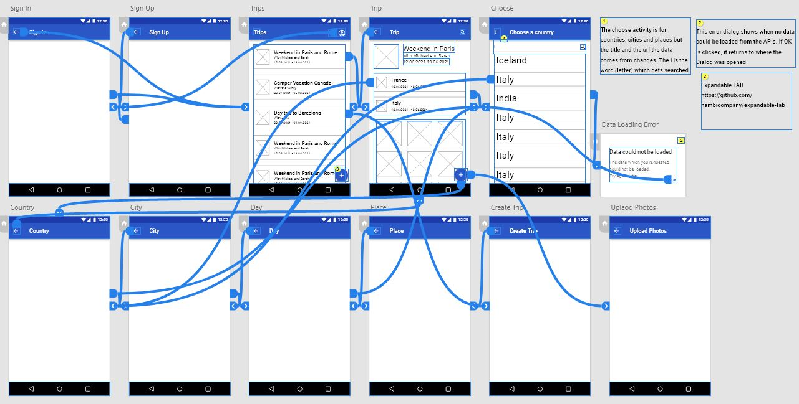
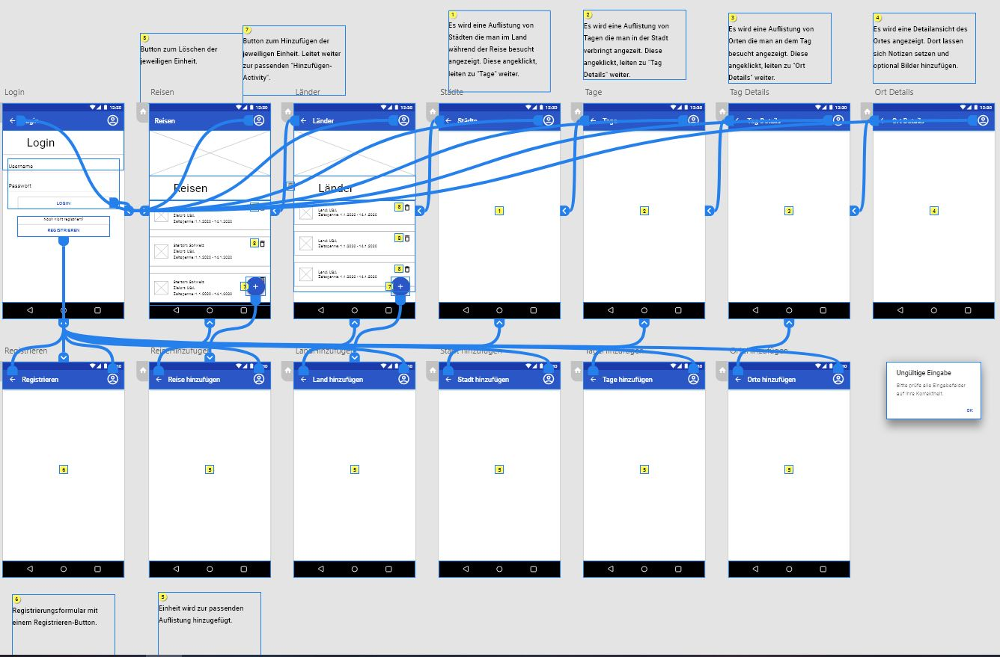

# Documentation

## Inhalt

1. [Projektmitarbeiter](#Projektmitarbeiter)
2. [Dokumentation](#Dokumentation)
3. [Daily Scrum](#Daily-Scrum)
4. [Definition of Done](#Definition-of-Done)
5. [Codestyle](#Codestyle)
	1. [Code](#Code)
	2. [JavaDoc](#JavaDoc)
	
## Projektmitabeiter
* [Alain Roser](https://git.bbcag.ch/brosea) (Product Owner, Team Member)
* [Jan Henke](https://git.bbcag.ch/bhenkj) (Product Owner, Team Member)

## Dokumentation
* [Documentation](docs/documentation/documentation.md)

## Mockups

    

    

## Klassendiagramm

    

## Testfälle
* [Testing](docs/documentation/documentation.md#6-testing)

## Daily Scrum
* Das Daily Scrum wird jeweils um 08:15 gehalten.

## Definition of Done
* Die Userstory ist angemessen dokumentiert
* Testprotokolle vorhanden und ausgefüllt
* Von anderen Benutzern getestet
* Code Style wird eingehalten
* Code ist aufgeräumt

## Codestyle
### Code
* Tabs statt Spaces
* Align when multiline
* Align 'throws' to method start when multiline

### JavaDoc
* Align parameter descriptions
* Align thrown exception descriptions 
* Blank line after description 
* Blank line after parameter description 
* Blank line after return tag 
* Wrap at right margin 
* Keep empty lines 
* Preserve line feeds
* Parameter description on new line