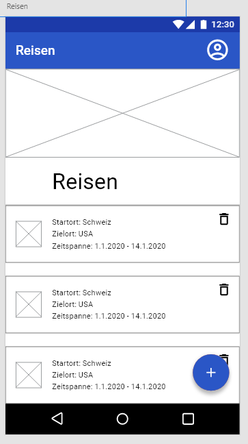
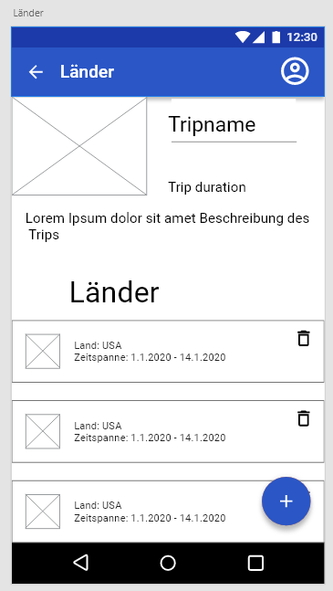
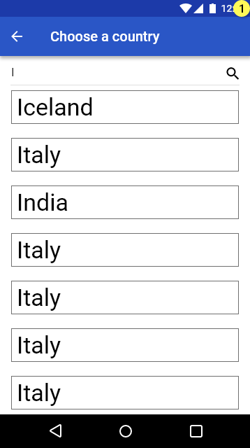
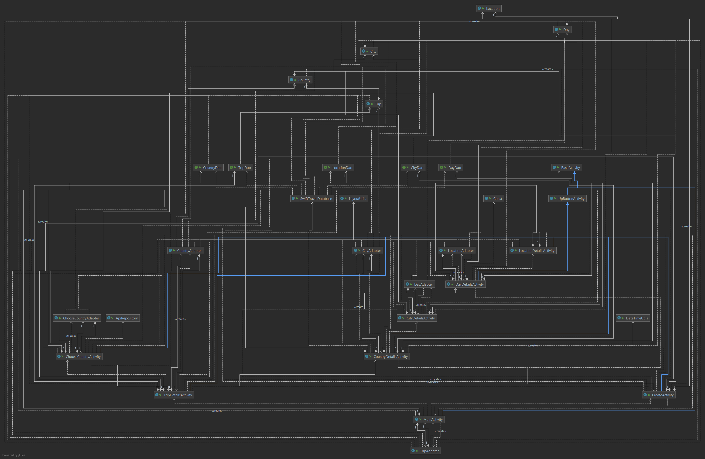

# Swift-Travel

## Inhalt

1. [Abstract (Kurzbeschreibung)](#abstract-kurzbeschreibung)
2. [Konkurrenzanalyse](#konkurrenzanalyse)
3. [Design](#design)
   1. [Mockups](#mockups)
   2. [Klassendiagramm](#klassendiagramm)
4. [Technische Realisierung](#technische-realisierung)
   1. [Room Database](#room-database)
      1. [SwiftTravelDatabase](#swifttraveldatabase)
      2. [DAOs](#daos)
      3. [Entities](#entities)
   2. [Restcountries API](#restcountries-api)
      1. [ChooseCountryActivity](#choosecountryactivity)
5. [Testing](#testing)
    1. [Manuelle UI-Tests](#manuelle-ui-tests)
    2. [Testauswertung](#testauswertung)
6. [Fazit](#fazit)
   1. [Positives](#positives)
   2. [Negatives](#negatives)

# Abstract (Kurzbeschreibung)

> Swift-Travel ist ein Projekt bei dem der Benutzer seine zukünftigen Reisen planen, sowie auch seine bereits getätigten Reisen festhalten und später wieder betrachten kann
> Man hat dafür Trips, welche man hinzufügen kann, worin man Länder, welche man auf diesem Trip besucht, hinzufügen kann
> dort wiederum hat man die Möglichkeit Städte in den einzelnen Ländern hinzuzufügen
> Pro Stadt hat man dann Tage (Die Anzahl entspricht der Zeitspanne, welche man in dieser Stadt verbringt) in welchen man dann festhalten kann, was man hier gemacht hat

# Konkurrenzanalyse
<table>
   <tbody>
      <tr>
         <th>Konkurrenten</th>
         <th>Beobachtung</th>
      </tr>
      <tr>
         <td>
            <ul>
               <li><a href="https://play.google.com/store/apps/details?id=com.tripit">TripIt: Reiseplaner</a></li>
               <li><a href="https://play.google.com/store/apps/details?id=com.travalour.tripplanner">TripPlanner - Trips & Travel planner(no sign-in)</a> </li>
               <li><a href="https://play.google.com/store/apps/details?id=com.travefy.travelplannersapp.tripplans">My Travel Planner App</a> </li> 
               <li><a href="https://play.google.com/store/apps/details?id=com.roadtrippers">Roadtrippers - Trip Planner</a></li> 
            </ul>
         </td>
         <td>
            <ul>
               <h3> Was machen sie gut </h3>
               <li>Auflistung und Unterteilung der Reisen</li>
               <li>Übersichtlich</li>
               <h3>Was machen sie schlecht</h3>
               <li>Persönliche Erinnerungen können nicht hinzugefügt werden</li>
               <li>Beschränkt (Keine genaueren Informationen über Ausflüge)</li>
               <h3>Wie können wir uns abheben</h3>
               <li>Persönlicher (Möglichkeit persönliche Erinnerungen hinzufügen zu können)</li>
               <li>Weniger beschränkt (Möglichkeit Informationen über Ausflüge hinzufügen zu können)</li>
               <li>Ziel ist nicht die Planung sondern die Reisen</li>
            </ul>
         </td>
      </tr>
   </tbody>
</table>

<table>
   <tbody>
      <tr>
         <th>Konkurrenten</th>
         <th>Beobachtung</th>
      </tr>
      <tr>
         <td>
            <ul>
               <li><a href="https://play.google.com/store/apps/details?id=io.lambus.app">Lambus | Reiseplaner</a></li>
               <li><a href="https://play.google.com/store/apps/details?id=com.devpira.travel_plan">NextTripPlan | Trip Planner</a> </li>
               <li><a href="https://play.google.com/store/apps/details?id=com.blahovici.itinerate">Itinerate</a> </li>
            </ul>
         </td>
         <td>
            <ul>
               <h3> Was machen sie gut </h3>
               <li>Persönliche Erinnerungen können hinzugefügt werden </li>
               <h3>Was machen sie schlecht</h3>
               <li> Unübersichtlich</li>
               <h3>Wie können wir uns abheben</h3>
               <li>Einfacher und übersichtlicher aufgebaut</li>
               <li>Ziel ist nicht die Planung sondern die Reisen</li>
            </ul>
         </td>
      </tr>
   </tbody>
</table>

# Design
## Mockups

> ***1. Trips***  
>   
> Dies ist die Startactivity. Man hat hier die Möglichkeit mithilfe eines Floating Action Buttons Reisen hinzuzufügen, welche dann in einer Liste angezeigt werden.

> ***2.	Tripdetails***  
>   
> In diese kommt man, indem man einen Eintrag der Liste der ersten Activity anklickt. Hier hat man zuerst Informationen zum Trip, welche man auch bearbeiten kann
> Darunter ist ebenfalls eine Liste, diesmal aber mit allen Ländern, welche man in diesem Trip besucht und auch hier hat es einen Floating Action Button, mitwelchem man Länder hinzufügen kann

> ***3. Sign In***   
>   
> In diese Activity kommt man durch den Klick auf den Floating Action der TripDetailsActivity klickt
> Sie beinhaltet eine Liste mit allen Ländern, welche man auch durchsuchen kann, welche man dann zu der Liste der Länder im Trip der TripDetailsActivity hinzufügen kann

## Klassendiagramm


# Technische Realisierung

## Room Database
> Alle Trips, Countries, Cities, Days und Locations werden lokal in einer Room Datenbank gespeichert.

### SwiftTravelDatabase
> Die Datenbank mit den Gettern für die DAOs
```Java
@androidx.room.Database(entities = {Trip.class, Country.class, City.class, Day.class, Location.class}, version = 1, exportSchema = false)
public abstract class SwiftTravelDatabase extends RoomDatabase {
	private static SwiftTravelDatabase INSTANCE;

	public static synchronized SwiftTravelDatabase getInstance(Context context) {
		if (INSTANCE == null) {
			INSTANCE = Room.databaseBuilder(context.getApplicationContext(), SwiftTravelDatabase.class, "SwiftTravelDatabase").allowMainThreadQueries().fallbackToDestructiveMigration().build();
		}
		return INSTANCE;
	}

	public abstract TripDao getTripDao();

	public abstract CountryDao getCountryDao();

	public abstract CityDao getCityDao();

	public abstract DayDao getDayDao();

	public abstract LocationDao getLocationDao();
}
```

### DAOs
* TripDao, CountryDao, CityDao, DayDao und LocationDao
> Die Data Access Objects mit den Abfragen für die Entities
#### Aufbau eines Daos
Es gibt jeweils ein Select-Statement für alle Einträge mit der übergeordneten ID (im Beispiel Select * from cities where countryId = countryId) im TripDao wird jeder Eintrag ausgelesen und dargestellt. Desweiteren bekommen die Daos weitere Abfragen die für das Löschen einzelner Einträge nötig sind.
```Java
@Dao
public interface CityDao {
	@Query("SELECT * FROM cities WHERE countryId = :countryId")
	List<City> getAllFromCountry(long countryId);

	@Query("SELECT * FROM cities WHERE id = :id")
	City getById(long id);

	@Insert
	long insert(City city);

	@Update
	void update(City city);

	@Query("DELETE FROM cities WHERE id = :id")
	void deleteById(long id);
}
```

### Entities 
> Trip, Country, City, Day 
> Die Entities mit den einzelnen Columns und den Gettern und Settern dafür

## Restcountries API
> Bei der TripDetailsActivity soll eine Liste von den Ländern angezeigt werden, welche man in diesem Trip besucht

### ChooseCountryActivity
> Man kann Countries hinzufügen mit einem Klick auf den Floating Action Button in den TripDetails hinzufügen
> Man kommt dann in diese Activity wo man eine Liste mit den Ländernamen und Flaggen sieht
> Diese Informationen werden von der restcountries API unter [diesem Link](https://restcountries.eu/rest/v2/all) abgerufen

# Testing

> [Testing](testing.md)

# Fazit

## Positives 
> Die Zusammenarbeit hat sehr gut geklappt 
> Alle Pflicht-Ziele wurden erreicht 
> Auch einige optionale (aber nicht alle) Ziele wurden erreicht
> Viel Neues gelernt (Android App Entwicklung, Android, Java, ...)
> Sehr zufrieden mit dem Endprodukt 
## Negatives
> Es wurden nicht alle optionalen Ziele erreicht (aber die Wichtigsten)
> Wir arbeiteten oft an derselben Datei, weshalb man dann mergen musste (Worum man aber fast nicht kommt)
