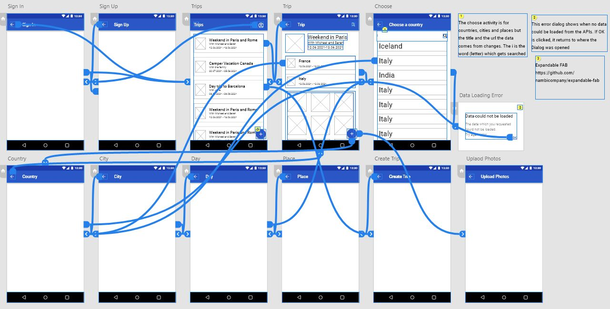
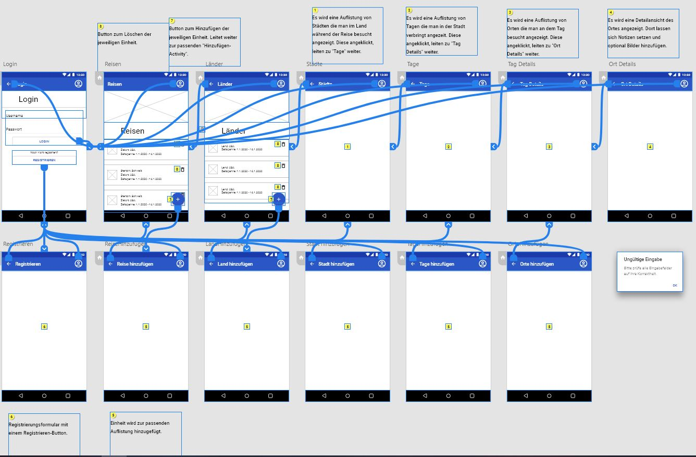
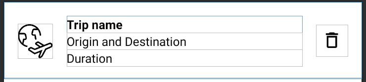

# Swift-Travel

## Inhalt

1. [Abstract (Kurzbeschreibung)](#abstract-kurzbeschreibung)
2. [Konkurrenzanalyse](#konkurrenzanalyse)
3. [Design](#design)
   1. [Mockups](#mockups)
      1. [Mockup Alain](#mockup-alain)
      2. [Mockup Jan](#mockup-jan)
      3. [Activity-Beschreibung](#activity-beschreibung)
   2. [Klassendiagramm](#klassendiagramm)
4. [Technische Realisierung](#technische-realisierung)
   1. [Room Database](#room-database)
      1. [SwiftTravelDatabase](#swifttraveldatabase)
      2. [DAOs](#daos)
      3. [Entities](#entities)
   2. [Restcountries API](#restcountries-api)
      1. [ChooseCountryActivity](#choosecountryactivity)
   3. [Darstellen der Listen](#darstellung-der-listen)
      1. [ListView in der Activity](#listview-in-der-activity)
      2. [Adapter](#adapter)
      3. [Custom-List-Item](#custom-list-item-xml)
5. [Testing](#testing)
6. [Fazit](#fazit)
   1. [Positives](#positives)
   2. [Negatives](#negatives)

# Abstract (Kurzbeschreibung)

> Swift-Travel ist ein Projekt bei dem der Benutzer seine zukünftigen Reisen planen, sowie auch seine bereits getätigten Reisen festhalten und später wieder betrachten kann
> Man hat dafür Trips, welche man hinzufügen kann, worin man Länder, welche man auf diesem Trip besucht, hinzufügen kann
> dort wiederum hat man die Möglichkeit Städte in den einzelnen Ländern hinzuzufügen
> Pro Stadt hat man dann Tage (Die Anzahl entspricht der Zeitspanne, welche man in dieser Stadt verbringt) in welchen man dann festhalten kann, was man hier gemacht hat

# Konkurrenzanalyse
<table>
   <tbody>
      <tr>
         <th>Konkurrenten</th>
         <th>Beobachtung</th>
      </tr>
      <tr>
         <td>
            <ul>
               <li><a href="https://play.google.com/store/apps/details?id=com.tripit">TripIt: Reiseplaner</a></li>
               <li><a href="https://play.google.com/store/apps/details?id=com.travalour.tripplanner">TripPlanner - Trips & Travel planner(no sign-in)</a> </li>
               <li><a href="https://play.google.com/store/apps/details?id=com.travefy.travelplannersapp.tripplans">My Travel Planner App</a> </li> 
               <li><a href="https://play.google.com/store/apps/details?id=com.roadtrippers">Roadtrippers - Trip Planner</a></li> 
            </ul>
         </td>
         <td>
            <ul>
               <h3> Was machen sie gut </h3>
               <li>Auflistung und Unterteilung der Reisen</li>
               <li>Übersichtlich</li>
               <h3>Was machen sie schlecht</h3>
               <li>Persönliche Erinnerungen können nicht hinzugefügt werden</li>
               <li>Beschränkt (Keine genaueren Informationen über Ausflüge)</li>
               <h3>Wie können wir uns abheben</h3>
               <li>Persönlicher (Möglichkeit persönliche Erinnerungen hinzufügen zu können)</li>
               <li>Weniger beschränkt (Möglichkeit Informationen über Ausflüge hinzufügen zu können)</li>
               <li>Ziel ist nicht die Planung sondern die Reisen</li>
            </ul>
         </td>
      </tr>
   </tbody>
</table>

<table>
   <tbody>
      <tr>
         <th>Konkurrenten</th>
         <th>Beobachtung</th>
      </tr>
      <tr>
         <td>
            <ul>
               <li><a href="https://play.google.com/store/apps/details?id=io.lambus.app">Lambus | Reiseplaner</a></li>
               <li><a href="https://play.google.com/store/apps/details?id=com.devpira.travel_plan">NextTripPlan | Trip Planner</a> </li>
               <li><a href="https://play.google.com/store/apps/details?id=com.blahovici.itinerate">Itinerate</a> </li>
            </ul>
         </td>
         <td>
            <ul>
               <h3> Was machen sie gut </h3>
               <li>Persönliche Erinnerungen können hinzugefügt werden </li>
               <h3>Was machen sie schlecht</h3>
               <li> Unübersichtlich</li>
               <h3>Wie können wir uns abheben</h3>
               <li>Einfacher und übersichtlicher aufgebaut</li>
               <li>Ziel ist nicht die Planung sondern die Reisen</li>
            </ul>
         </td>
      </tr>
   </tbody>
</table>

# Design
## Mockups

### Mockup Alain


### Mockup Jan


### Activity-Beschreibung
#### MainActivity
In der MainActivity werden hinzugefügte Trips angezeigt und können für eine Detailansicht angeklickt werden. Es gibt desweiteren einen Floating-Action-Button zum Hinzufügen neuer Trips.
#### TripDetailsActivity
In der TripDetailsActivity wird die Detailansicht des Trips angezeigt mit einer Beschreibung, Dauer und Auflistung der Länder die man innerhalb dieses Trips besucht.
#### CountryDetailsActivity
In der CountryDetailsActivity werden die Beschreibung, Aufenthaltsdauer und eine Auflistung aller selbst hinzugefügten Städte angezeigt. Hier gibt es auch wieder einen Floating-Action-Button um neue Städte hinzufügen zu können.
#### CityDetailsActivity
In der CityDetailsActivity werden die Beschreibung, Aufenthaltsdauer und die Auflistung aller Tage, welche man in der Stadt verbringt angezeigt. Die Anzahl Tage werden automatisch anhand der Aufenthaltsdauer in der Stadt berechnet und daraus dann Tage in der Liste erstellt.
#### DayDetailsActivity
Die DayDetailsActivity hat wieder eine Beschreibung, das Datum und eine Auflistung von Locations, welche der Benutzer hinzugefügt hat angezeigt. Hier gibt es nun wieder einen Floating-Action-Button um neue Locations hinzufügen zu können.
#### LocationDetailsActivity
In den LocationDetails wird nun noch eine Information zur hinzugefügten Location angezeigt, bei welcher man eine Beschreibung und die Aufenthaltsdauer sehen kann.
#### ChooseCountryActivity
In der ChooseCountryActivity können Countries aus einer Liste ausgewählt und zum Trip hinzugefügt werden.
#### UpButtonActivity & BaseActivity
Die UpButton- & BaseActivity sind die Standard-Activities, von denen die anderen erben. Hier wird der Up-Button hinzugefügt und Standard-Elemente wie die Progress-Bar

*Bei sämtlichen Activities (ausser UpButton-, Base- und LocationDetailsActivity) gibt es eine Suchfunktion um die vorhandene Liste zu filtern.

## Klassendiagramm


# Technische Realisierung

## Room Database
> Alle Trips, Countries, Cities, Days und Locations werden lokal in einer Room Datenbank gespeichert.

### SwiftTravelDatabase
> Die Datenbank mit den Gettern für die DAOs
```Java
@androidx.room.Database(entities = {Trip.class, Country.class, City.class, Day.class, Location.class}, version = 1, exportSchema = false)
public abstract class SwiftTravelDatabase extends RoomDatabase {
	private static SwiftTravelDatabase INSTANCE;

	public static synchronized SwiftTravelDatabase getInstance(Context context) {
		if (INSTANCE == null) {
			INSTANCE = Room.databaseBuilder(context.getApplicationContext(), SwiftTravelDatabase.class, "SwiftTravelDatabase").allowMainThreadQueries().fallbackToDestructiveMigration().build();
		}
		return INSTANCE;
	}

	public abstract TripDao getTripDao();

	public abstract CountryDao getCountryDao();

	public abstract CityDao getCityDao();

	public abstract DayDao getDayDao();

	public abstract LocationDao getLocationDao();
}
```

### DAOs
* TripDao, CountryDao, CityDao, DayDao und LocationDao
> Die Data Access Objects mit den Abfragen für die Entities
#### Aufbau eines Daos
Es gibt jeweils ein Select-Statement für alle Einträge mit der übergeordneten ID (im Beispiel Select * from cities where countryId = countryId) im TripDao wird jeder Eintrag ausgelesen und dargestellt. Desweiteren bekommen die Daos weitere Abfragen die für das Löschen einzelner Einträge nötig sind.
```Java
@Dao
public interface CityDao {
	@Query("SELECT * FROM cities WHERE countryId = :countryId")
	List<City> getAllFromCountry(long countryId);

	@Query("SELECT * FROM cities WHERE id = :id")
	City getById(long id);

	@Insert
	long insert(City city);

	@Update
	void update(City city);

	@Query("DELETE FROM cities WHERE id = :id")
	void deleteById(long id);
}
```

### Entities 
* Trip, Country, City, Day, Location
* Die Entities mit den einzelnen Columns und den Gettern und Settern dafür
```Java 
@Entity(tableName = "days")
public class Day {
	@PrimaryKey(autoGenerate = true)
	@ColumnInfo(name = "id")
	private long id;
	@ColumnInfo(name = "name")
	private String name;
	@ColumnInfo(name = "description")
	private String description;
	@ColumnInfo(name = "imageURI")
	private String imageURI;
	@ColumnInfo(name = "cityId")
	private long cityId;
	@ColumnInfo(name = "date")
	private String date;
	@Ignore
	private List<Location> locationList = new ArrayList<>();

	public Day() {
	}

	@NonNull
	@Override
	public String toString() {
		return name;}
	public long getId() {
		return id;}
	public void setId(long id) {
		this.id = id;}
	public String getName() {
		return name;}
	public void setName(String name) {
		this.name = name;}
	public String getDescription() {
		return description;}
	public void setDescription(String description) {
		this.description = description;}
	public long getCityId() {
		return cityId;}
	public void setCityId(long cityId) {
		this.cityId = cityId;}
	public String getImageURI() {
		return imageURI;}
	public void setImageURI(String imageURI) {
		this.imageURI = imageURI;}
	public String getDate() {
		return date;}
	public void setDate(String date) {
		this.date = date;}
	public List<Location> getLocationList() {
		return locationList;}
	public void setLocationList(List<Location> locationList) {
		this.locationList = locationList;}
}
```

## Restcountries API
> Bei der TripDetailsActivity soll eine Liste von den Ländern angezeigt werden, welche man in diesem Trip besucht

### ChooseCountryActivity
> Man kann Countries hinzufügen mit einem Klick auf den Floating Action Button in den TripDetails hinzufügen
> Man kommt dann in diese Activity wo man eine Liste mit den Ländernamen und Flaggen sieht
> Diese Informationen werden von der restcountries API unter [diesem Link](https://restcountries.eu/rest/v2/all) abgerufen

## Darstellung der Listen
### Listview in der Activity
Hinzufügen von List-Items zu einer Clickable-List.
```Java
 public void addCitiesToClickableList() {
     ListView cities = findViewById(R.id.cities);
     cities.setAdapter(adapter);
     adapter.sort(this::compareCityStartDates);

     getProgressBar().setVisibility(View.GONE);

     AdapterView.OnItemClickListener mListClickedHandler = (parent, v, position, id) -> {
         Intent intent = new Intent(getApplicationContext(), CityDetailsActivity.class);
         City selected = (City) parent.getItemAtPosition(position);
         intent.putExtra(Const.CITY_NAME, selected.getName());
         intent.putExtra(Const.CITY, selected.getId());
         startActivity(intent);
     };

     cities.setOnItemClickListener(mListClickedHandler);
 }
```
### Adapter
Der Adapter um die einzelnen List-Items zum korrekten XML-File zuzuordnen.
Die Funktionalität zum Löschen eines Items aus der Liste, sowie das Löschen aus der Datenbank befinden sich ebenfalls im Adapter.
```Java
public class CountryAdapter extends ArrayAdapter<Country> {
	private TripDetailsActivity tripDetailsActivity;

	public CountryAdapter(TripDetailsActivity tripDetailsActivity, List<Country> countries) {
		super(tripDetailsActivity, R.layout.two_line_list, countries);
		this.tripDetailsActivity = tripDetailsActivity;
	}

	@Override
	public View getView(int position, View convertView, ViewGroup parent) {
		final Country country = getItem(position);
		final CountryAdapterViewHolder viewHolder;

		if (convertView == null) {
			viewHolder = new CountryAdapterViewHolder();
			LayoutInflater inflater = LayoutInflater.from(tripDetailsActivity);
			convertView = inflater.inflate(R.layout.two_line_list, parent, false);

			viewHolder.name = convertView.findViewById(R.id.name_two_line_list);
			viewHolder.duration = convertView.findViewById(R.id.duration_or_date_two_line_list);
			viewHolder.image = convertView.findViewById(R.id.image_two_line_list);
			viewHolder.delete = convertView.findViewById(R.id.delete_two_line_list);

			convertView.setTag(viewHolder);
		} else {
			viewHolder = (CountryAdapterViewHolder) convertView.getTag();
		}

		addInformationToAdapter(viewHolder, country);
		return convertView;
	}

	private void addInformationToAdapter(CountryAdapterViewHolder viewHolder, Country country) {
		viewHolder.delete.setOnClickListener(v -> generateConfirmDialog(country));

		viewHolder.name.setText(country.getName());
		String duration;
		if (country.getDuration() == 1) {
			duration = country.getDuration() + " " + tripDetailsActivity.getString(R.string.day);
		} else {
			duration = country.getDuration() + " " + tripDetailsActivity.getString(R.string.days);
		}
		viewHolder.duration.setText(duration);
		LayoutUtils.setOnlineImageURIOnImageView(getContext(), viewHolder.image, country.getImageURI());
	}

	private void generateConfirmDialog(Country country) {
		tripDetailsActivity.generateConfirmDialog(tripDetailsActivity.getString(R.string.delete_entry_title), tripDetailsActivity.getString(R.string.delete_entry_text), () -> {
			remove(country);
			notifyDataSetChanged();
			deleteCities(country);
			SwiftTravelDatabase.getInstance(tripDetailsActivity.getApplicationContext()).getCountryDao().deleteById(country.getId());
		});
	}

	private void deleteCities(Country country) {
		List<City> cities = SwiftTravelDatabase.getInstance(tripDetailsActivity.getApplicationContext()).getCityDao().getAllFromCountry(country.getId());
		for (City city : cities) {
			deleteDays(city);
			SwiftTravelDatabase.getInstance(tripDetailsActivity.getApplicationContext()).getCityDao().deleteById(city.getId());
		}
	}

	private void deleteDays(City city) {
		List<Day> days = SwiftTravelDatabase.getInstance(tripDetailsActivity.getApplicationContext()).getDayDao().getAllFromCity(city.getId());
		for (Day day : days) {
			deleteLocations(day);
			SwiftTravelDatabase.getInstance(tripDetailsActivity.getApplicationContext()).getDayDao().deleteById(day.getId());
		}
	}

	private void deleteLocations(Day day) {
		List<Location> locations = SwiftTravelDatabase.getInstance(tripDetailsActivity.getApplicationContext()).getLocationDao().getAllFromDay(day.getId());
		for (Location location : locations) {
			SwiftTravelDatabase.getInstance(tripDetailsActivity.getApplicationContext()).getLocationDao().deleteById(location.getId());
		}
	}

	public static class CountryAdapterViewHolder {
		TextView name;
		TextView duration;
		ImageView image;
		ImageButton delete;
	}
}
```
### Custom-List-Item-XML
Unsere Custom-List-Items bestehen aus einer ImageView, diversen TextViews (je nach Anzahl Lines) und bei löschbaren Items noch der Löschen-Button.


# Testing

> [Testing](testing.md)

# Fazit

## Positives 
> Die Zusammenarbeit hat sehr gut geklappt 
> Alle Pflicht-Ziele wurden erreicht 
> Auch einige optionale (aber nicht alle) Ziele wurden erreicht
> Viel Neues gelernt (Android App Entwicklung, Android, Java, ...)
> Sehr zufrieden mit dem Endprodukt 
## Negatives
> Es wurden nicht alle optionalen Ziele erreicht (aber die Wichtigsten)
> Wir arbeiteten oft an derselben Datei, weshalb man dann mergen musste (Worum man aber fast nicht kommt)
